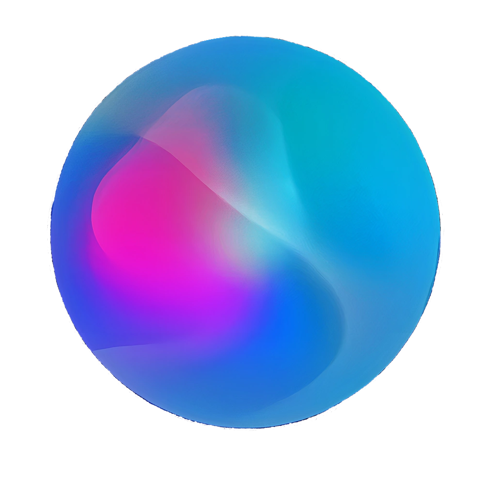

# Synergi - Your Open Source AI Assistant 🤖



**Screenshot:**


<p align="center">
  <a href="https://github.com/synergi/synergi/stargazers">
    
  </a>
  <a href="https://github.com/synergi/synergi/network/members">
    
  </a> 
  <a href="https://github.com/synergi/synergi/issues">
    
  </a>
</p>

Synergi is an open-source AI assistant that brings productivity and innovation to your daily tasks. It's designed for users looking for an experience similar to Windows 11's Copilot, but with the added benefits of being open source and more performant in certain tasks.

## 🎉 Demo

Stay tuned for our exciting demo, showcasing Synergi's capabilities!

## 🚀 Getting Started

### Installation

To quickly set up Synergi, we provide two convenient scripts:

1. `installation.sh` - Installs the necessary dependencies.
2. `start.sh` - Launches Synergi.

Simply run the following commands to get started:

```bash
./installation.sh
./start.sh
```

### Configuration

To personalize your Synergi experience and enable advanced features, navigate to the `core/params` folder and modify the `config.json` file. You'll need to replace the placeholder API keys with your actual keys from OpenAI, Pinecone, ElevenLabs, and Clarifai.

### Features

Synergi boasts a range of features that enhance your daily workflow:

- **Natural Language Processing** - Communicate with Synergi using plain language.
- **Task Scheduling** - Set reminders and automate workflows.
- **Voice Interactions** - Enjoy speech synthesis and recognition capabilities.
- **Image Generation** - Harness the power of DALL·E and StableDiffusion for image generation.
- **Document Interaction** - Communicate with documents through the user interface.
- **Multiprocessing** - Enhance speed and performance with a multiprocessing architecture.

## 👥 Project Contributors

Synergi is made possible by contributions from our dedicated community of [awesome contributors](https://github.com/synergi/synergi/graphs/contributors). Join us in shaping the future of AI!

## 🎁 Supporting Synergi

While Synergi will always remain open source and free, you can support its development through [Open Collective](https://opencollective.com/synergi) or by buying us a coffee:

[](https://www.buymeacoffee.com/nerdly)

Let's collaboratively build the future of AI, one helpful, open, and high-performing assistant at a time. 🤝

## 🚧 Work in Progress

Please note that Synergi is still under construction and in the testing phase. Expect continuous improvements and updates as we expand its capabilities and features.

## 🧩 Extensibility

Synergi is designed to be extensible. You can easily add new tools and functionalities that Synergi can execute, such as browsing tools or other utilities. Explore the possibilities and contribute to making Synergi even more powerful!

Enjoy your journey with Synergi, your reliable open-source AI assistant.
```
